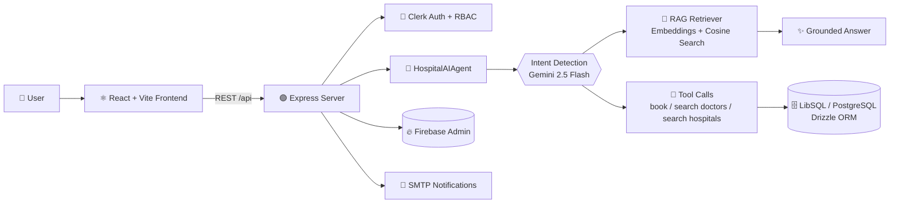

#<div align="center">


### An AI-powered hospital management & appointment platform
Search hospitals and doctors, book appointments, and get grounded answers, all through natural language.

<p>
  
  
  
  
</p>
<p>
  
  
  
  
  
</p>

[Features](#-features) •
[Architecture](#-architecture) •
[Tech Stack](#-tech-stack) •
[Getting Started](#-getting-started) •
[Evaluation](#-evaluation) •
[Roadmap](#-roadmap)

</div>

---

## 📖 Overview

**Hospital AI Agent** turns a traditional hospital appointment system into a production-minded, AI-driven platform. An **agent orchestrator** classifies what the user wants, retrieves trusted hospital and doctor knowledge with **RAG**, and issues **structured tool calls** to the backend, so the LLM never touches your database directly.

The platform has three dedicated experiences:

| 🧑‍🤝‍🧑 Patients | 👨‍⚕️ Doctors | 🛠️ Admins |
|---|---|---|
| Find hospitals & doctors | Manage appointments | Manage users, doctors & patients |
| Book & track appointments | Doctor dashboard | Appointment oversight |
| Chat with the AI assistant | Patient information | Audit logs & system settings |
| Emergency SOS | Doctor directory | Analytics dashboard |

---

## ✨ Features

### 🤖 AI Hospital Assistant
- Natural-language chat for hospital, doctor and appointment tasks
- **Intent detection** powered by Gemini 2.5 Flash
- **Structured tool calling**: `book_appointment`, `search_doctors`, `search_hospitals`
- Answers grounded in retrieved context to reduce hallucination

### 🔎 RAG & Semantic Search
- Gemini `text-embedding-004` embeddings
- In-memory **cosine-similarity** vector search
- **Semantic chunking** by logical entity (hospital / doctor profiles) with rich metadata (`hospitalId`, `department`, `type`)
- **Hybrid fallback** to keyword search if the embedding API is rate-limited, for zero downtime

### 🚨 Healthcare Safety
- Emergency triage: critical symptoms trigger an emergency workflow (**call 108**), not a diagnosis
- The AI is never presented as a replacement for professional medical care
- **Prompt-injection defense**: user input is treated as untrusted
- Geolocation-based SOS flow

### 🔐 Security
- Role-based access control (`patient`, `doctor`, `admin`, `super_admin`)
- Clerk authentication with JWT-backed sessions
- Rate-limiting middleware
- Gemini API key kept **server-side only**
- Firestore security rules & typed, parameterized queries via Drizzle ORM

### 🗓️ Appointments
- Clinical rules engine: business-hour validation and no retroactive bookings
- Email notifications via Nodemailer / SMTP
- Interactive hospital map (Leaflet)

---

## 🏗️ Architecture



**How a request flows**

1. The user sends a message to `/api/chat`.
2. The agent classifies the intent: `appointment_booking`, `doctor_search`, `hospital_search`, `emergency` or `general_query`.
3. Relevant chunks are retrieved and injected inside `<context>` tags, and the model must answer only from them.
4. Any action is emitted as a **declarative JSON tool call**, validated and executed by the backend.

---

## 🧰 Tech Stack

| Layer | Technologies |
|---|---|
| **Frontend** | React 19, TypeScript, Vite, React Router, Tailwind CSS 4, Radix UI, shadcn, Lucide, Recharts, React Leaflet |
| **Backend** | Node.js, Express, TypeScript, `tsx`, esbuild |
| **AI** | Google Gemini 2.5 Flash, `text-embedding-004`, RAG, structured tool calling |
| **Database** | Drizzle ORM, SQLite / LibSQL, PostgreSQL (`pgvector` schema ready) |
| **Auth** | Clerk, Firebase / Firebase Admin |
| **Other** | Nodemailer, Supabase client |

---

## 🚀 Getting Started

### Prerequisites
- **Node.js** 18+ and npm
- A [Gemini API key](https://aistudio.google.com/apikey)
- A [Clerk](https://clerk.com) application (publishable + secret keys)

### 1. Clone & install
```bash
git clone https://github.com/<your-username>/Hospital-agent.git
cd Hospital-agent
npm install
```

### 2. Configure environment
Create a `.env` file in the project root:

```env
# AI
GEMINI_API_KEY=your_gemini_api_key

# Auth (Clerk)
VITE_CLERK_PUBLISHABLE_KEY=your_clerk_publishable_key
CLERK_SECRET_KEY=your_clerk_secret_key

# Database (optional, for PostgreSQL)
SQL_HOST=
SQL_DB_NAME=
SQL_ADMIN_USER=
SQL_ADMIN_PASSWORD=

# Supabase (optional)
VITE_SUPABASE_URL=
VITE_SUPABASE_ANON_KEY=

# Email notifications (optional)
SMTP_HOST=
SMTP_PORT=
SMTP_SECURE=
SMTP_USER=
SMTP_PASS=
SMTP_FROM=
```

> ⚠️ **Never commit `.env` or secret keys.** Make sure `.env` is listed in `.gitignore`.

### 3. Run
```bash
npm run dev
```
The full-stack server starts locally and serves both the API and the frontend.

### 4. Build for production
```bash
npm run build
npm start
```

---

## 📜 Scripts

| Command | Description |
|---|---|
| `npm run dev` | Start the local full-stack dev server |
| `npm run build` | Build client (Vite) and server (esbuild) |
| `npm start` | Run the production build |
| `npm run evaluate` | Run the intent & RAG evaluation pipeline |
| `npm run lint` | TypeScript type-check |
| `npm run db:generate` | Generate Drizzle migrations |
| `npm run db:migrate` | Apply Drizzle migrations |

---

## 🔌 API Endpoints

| Method | Endpoint | Auth | Description |
|---|---|---|---|
| `GET` | `/api/hospitals` | Public | List hospitals |
| `GET` | `/api/doctors` | Public | List doctors |
| `GET` | `/api/appointments` | 🔒 | Get the user's appointments |
| `POST` | `/api/appointments` | 🔒 | Book an appointment |
| `POST` | `/api/auth/sync` | 🔒 | Sync the Clerk user to the database |
| `POST` | `/api/chat` | Public | Chat with the AI agent |
| `POST` | `/api/symptom-checker` | Public | AI symptom guidance |
| `POST` | `/api/ai-recommend` | Public | AI hospital / doctor recommendations |

---

## 📁 Project Structure

```text
Hospital-agent/
├── server.ts                 # Express API + Vite integration
├── evaluate-rag.ts           # Intent & RAG evaluation runner
├── drizzle/                  # Database migrations
├── firestore.rules           # Firestore security rules
└── src/
    ├── components/           # UI: chatbot, dashboards, map, modals, admin
    │   └── ui/               # Reusable shadcn/Radix primitives
    ├── lib/                  # ai-agent, rag, emergency, roles, geo, email
    ├── middleware/           # auth & rate limiting
    ├── db/                   # Drizzle schema & queries
    ├── PatientApp.tsx        # Patient experience
    ├── AdminApp.tsx          # Admin experience
    └── main.tsx
```

---

## 📊 Evaluation

`npm run evaluate` runs test cases covering ambiguous searches, normal searches, general chat and emergency simulations.

| Metric | Result |
|---|---|
| Intent classification accuracy | **4 / 4** test cases passed |
| Retrieval hit rate | Verified via context-chunk injection count |
| Safety | Deterministic overrides for emergency triage |

---

## 🗺️ Roadmap

- [ ] Migrate the vector store to **PostgreSQL + pgvector** (Cloud SQL)
- [ ] Async pub/sub worker for continuous document ingestion
- [ ] Integrate **RAGAS** for context precision and faithfulness metrics
- [ ] Larger evaluation dataset

---

## ⚠️ Disclaimer

This project is a software demonstration. The AI assistant provides general guidance only and **does not replace professional medical advice, diagnosis, or treatment**. In an emergency, contact your local emergency services immediately.

---

## 🤝 Contributing

Contributions, issues and feature requests are welcome!

1. Fork the project
2. Create your branch: `git checkout -b feature/amazing-feature`
3. Commit your changes: `git commit -m "Add amazing feature"`
4. Push: `git push origin feature/amazing-feature`
5. Open a Pull Request

---

<div align="center">

**Built with ❤️ using React, Node.js and Gemini AI**

⭐ If you find this project useful, please give it a star!

</div>
